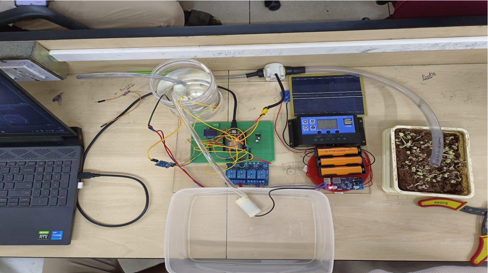
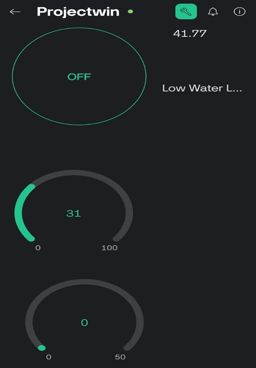
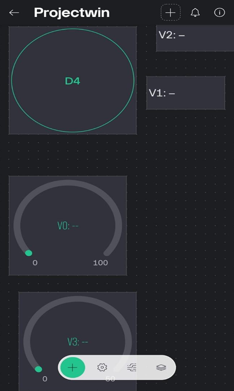

# 🌱 Solar-Powered IoT Smart Irrigation System

An ESP32-based smart irrigation system that automates irrigation using real-time soil moisture sensing, water flow monitoring, solar-powered operation, and Blynk IoT for remote monitoring and control.

---

## 📌 Overview

Water scarcity and inefficient irrigation practices are major challenges in modern agriculture. This project presents a **Solar-Powered IoT Smart Irrigation System** that automatically irrigates crops based on real-time soil moisture conditions while allowing users to remotely monitor and control the system through the **Blynk IoT platform**.

The system combines renewable energy with embedded systems and IoT technologies to provide an energy-efficient, autonomous, and sustainable irrigation solution suitable for farms and remote agricultural environments.

---

## ✨ Features

- 🌱 Automatic irrigation based on soil moisture
- ☀️ Solar-powered operation with MPPT charging
- 💧 Real-time water flow monitoring
- 🚰 Automatic water tank level monitoring
- 📱 Remote monitoring and manual control using Blynk IoT
- ⚡ ESP32-based embedded control
- 🔔 Low water level alert
- 🔄 Relay-controlled pump automation
- 📊 Live sensor data visualization

---

## 🛠 Hardware Used

- ESP32 Development Board
- Soil Moisture Sensor (YL-69)
- Water Flow Sensor (YF-S201)
- Float Level Sensor
- Relay Module
- 12V Water Pump
- Solar Panel
- MPPT Solar Charge Controller
- Lithium-Ion Battery
- Buck Converter
- Buzzer

---

## 💻 Software Used

- Arduino IDE
- Embedded C++
- Blynk IoT Platform
- ESP32 Wi-Fi Library

---

## ⚙ Working Principle

1. The soil moisture sensor continuously monitors the moisture content of the soil.
2. If the moisture level falls below the predefined threshold, the ESP32 automatically activates the irrigation pump.
3. The water flow sensor measures the amount of water supplied during irrigation.
4. The float sensor continuously monitors the storage tank water level.
5. When the water level becomes low, the refill pump is activated automatically.
6. The entire system is powered using a solar panel, MPPT charge controller, and rechargeable battery.
7. Users can monitor sensor readings and control the system remotely through the Blynk mobile application.

---

# 📷 Hardware Prototype

<p align="center">

</p>

---

# 📱 Blynk Dashboard

<p align="center">


</p>

---

## 📊 Results

The developed prototype successfully demonstrated:

- Automatic irrigation based on soil moisture
- Reliable water flow monitoring
- Autonomous water tank refilling
- Stable solar-powered operation
- Real-time IoT monitoring through Blynk
- Improved water-use efficiency with minimal human intervention

---

## 📂 Repository Structure

```
solar-powered-smart-irrigation-system
│
├── Smart_Irrigation.ino
├── smart_irrigation_report.pdf
├── README.md
└── images/
    ├── Hardware.png
    ├── Blynk1.png
    ├── Blynk2.png
```

---

## 🚀 Future Improvements

- AI-based irrigation prediction
- Weather forecast integration
- Cloud database support
- Mobile notifications
- Crop-specific irrigation scheduling
- Water consumption analytics
- Machine learning for irrigation optimization

---

## 📄 Project Report

A detailed project report describing the system design, implementation, and experimental evaluation is included in this repository.

📄 **smart_irrigation_report.pdf**

---

## 👩‍💻 Author

**Nivethitha R**

Electrical and Electronics Engineering Graduate


